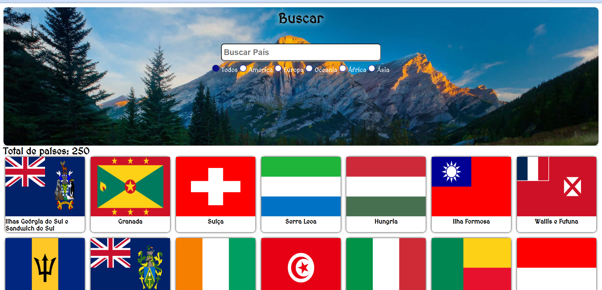
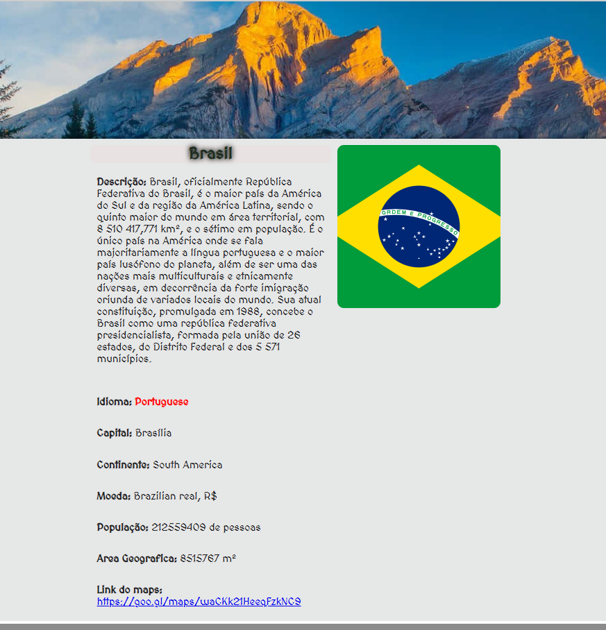

# Buscador de Informações de Países
Um buscador de paises desenvolvido como projeto para a diciplina de Programação Web I, utilizando APIs para buscar alguma informações de forma mais organizada de cada país.
## Design do Projeto
Página inicial


Página de informações


## APIs Utilizada
**Exemplo de EndPoint** `` https://restcountries.com/v3.1/currency/cop``

**Reposta do EndPoint**

``` json
  {
    "name": {
      "common": "Colombia",
      "official": "Republic of Colombia",
      "nativeName": {
        "spa": {
          "official": "República de Colombia",
          "common": "Colombia"
        }
      }
    },
    "currencies": {
      "COP": {
        "name": "Colombian peso",
        "symbol": "$"
      }
    },
    "capital": [
      "Bogotá"
    ],
    "region": "Americas",
    "subregion": "South America",
    "languages": {
      "spa": "Spanish"
    },
    "translations": {
      "por": {
        "official": "República da Colômbia",
        "common": "Colômbia"
    },
    },
    "area": 1141748,
    "demonyms": {
      "eng": {
        "f": "Colombian",
        "m": "Colombian"
      },
    },
    "flag": "🇨🇴",
    "maps": {
      "googleMaps": "https://goo.gl/maps/zix9qNFX69E9yZ2M6",
      "openStreetMaps": "https://www.openstreetmap.org/relation/120027"
    },
    "population": 50882884,
    "continents": [
      "South America"
    ],
    "flags": {
      "png": "https://flagcdn.com/w320/co.png",
      "svg": "https://flagcdn.com/co.svg",
      "alt": "The flag of Colombia is composed of three horizontal bands of yellow, blue and red, with the yellow band twice the height of the other two bands."
    },
    "coatOfArms": {
      "png": "https://mainfacts.com/media/images/coats_of_arms/co.png",
      "svg": "https://mainfacts.com/media/images/coats_of_arms/co.svg"
    },
  }

```
**Exemplo de EndPoint** ``https://pt.wikipedia.org/api/rest_v1/page/summary/brasil``

**Reposta do EndPoint**

``` json
{
  "extract": "Brasil, oficialmente República Federativa do Brasil, é o maior país da América do Sul e da região da América Latina, sendo o quinto maior do mundo em área territorial, com 8 510 417,771 km², e o sétimo em população. É o único país na América onde se fala majoritariamente a língua portuguesa e o maior país lusófono do planeta, além de ser uma das nações mais multiculturais e etnicamente diversas, em decorrência da forte imigração oriunda de variados locais do mundo. Sua atual Constituição, promulgada em 1988, concebe o Brasil como uma república federativa presidencialista, formada pela união dos 26 estados, do Distrito Federal e dos 5 571 municípios.",
  "thumbnail": {
    "source": "https://upload.wikimedia.org/wikipedia/commons/0/05/Flag_of_Brazil.svg",
    "width": 200,
    "height": 133
  }
}
```

## Funcionalidades
- [x] Busca por nome dos países
- [x] Busca por filtro
- [x] Principais informações de cada país
- [x] Contador de países
- [x] Botão de voltar para a página inicial
- [ ] Responsividade

## Observações
> [!Note]
> Projeto feito na disciplina de programação web I do curso ADS de ifce de Jaguaruana.

>[!IMPORTANT]
> Alguns Países podem não conter todas as informações.


## Contatos
- Email: ana.paula.silva06@aluno.ifce.edu.br
-LinkedIn: aninhapetrova2323@gmail.com